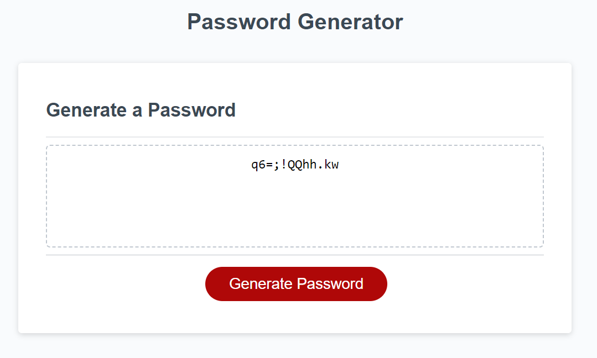

# my-random-password-generator

## Description

This is a website that allows the user to get a randomly generated password from their desired set of characters and length. This project was used as a tool to train my javascript skills. I was able to take appart the problem and go step by step to get to the solution and learned a lot new helpful things.

## Installation

N/A

## Usage

Go to the following link:
https://mayalynn96.github.io/my-random-password-generator/

Press the "Generate Password" button to generate a random password including the users choice of length, and weather they a certain set of characters. 

Once pressed a message will popup asking to enter a number between 8 and 128 characters.

If the entered value isn't a number or isn't within the asked range, an other popup will remind the user of the requested value and them return to the original promt.

Once a number is set, There will be 4 seperate popups asking weather the password should contain, numbers, lowercase letters, uppercase letters, and/or special characters. 

Once selected it will generate a random password containing the pool of character chosen.

In the event that the user did not select ANY of the 4 options, the they will be informed of the issue and send back to the very first popup asking for password length.

## Credits

N/A

## License
N/A